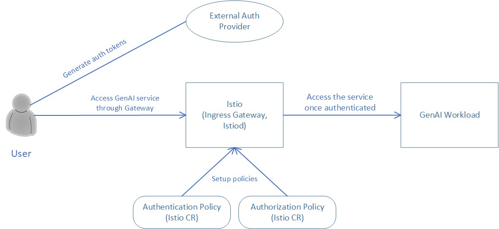
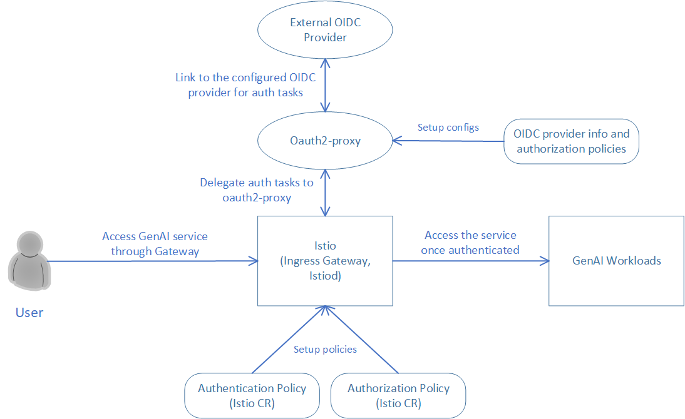
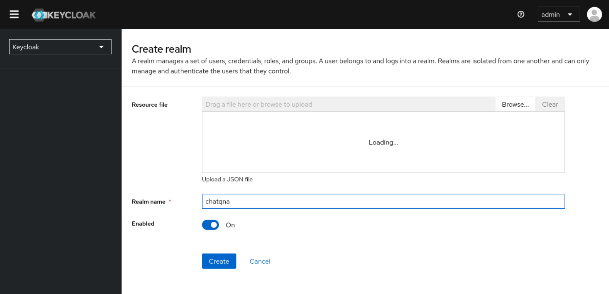
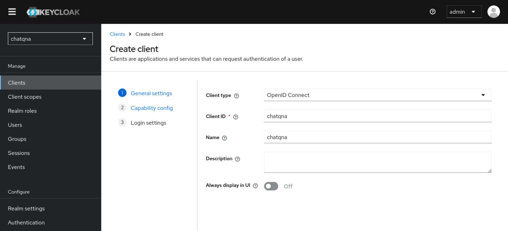
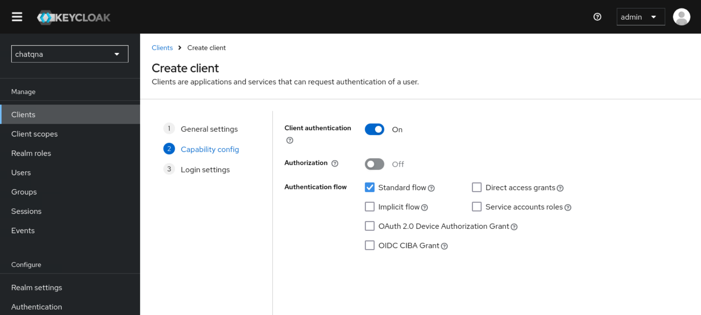
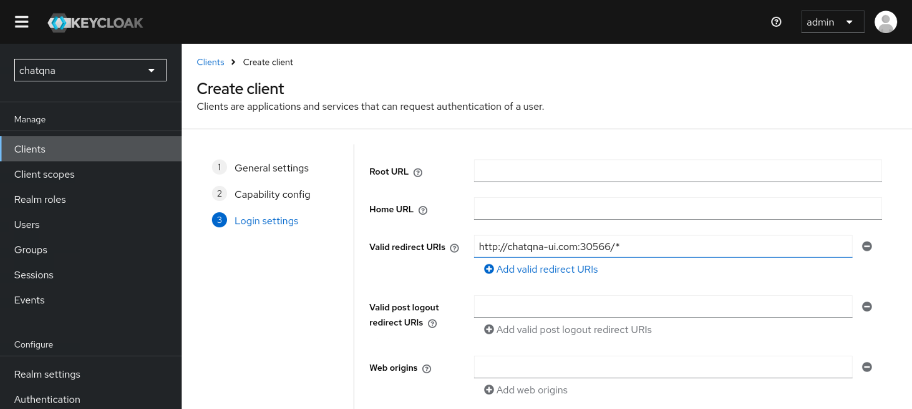
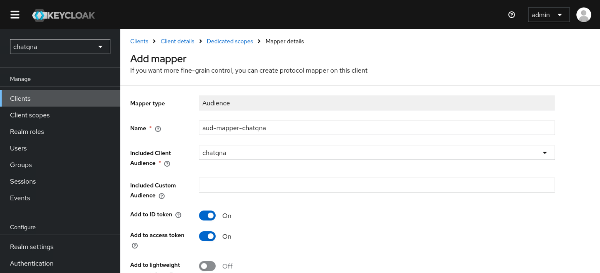
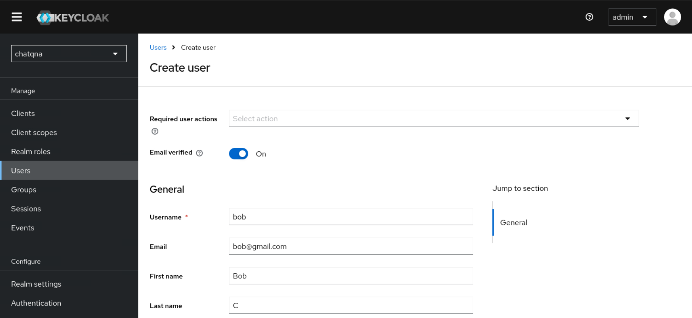
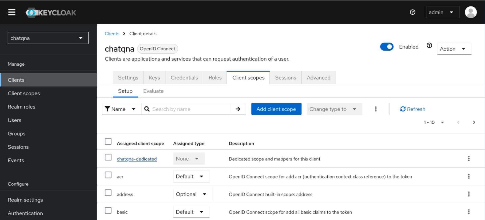
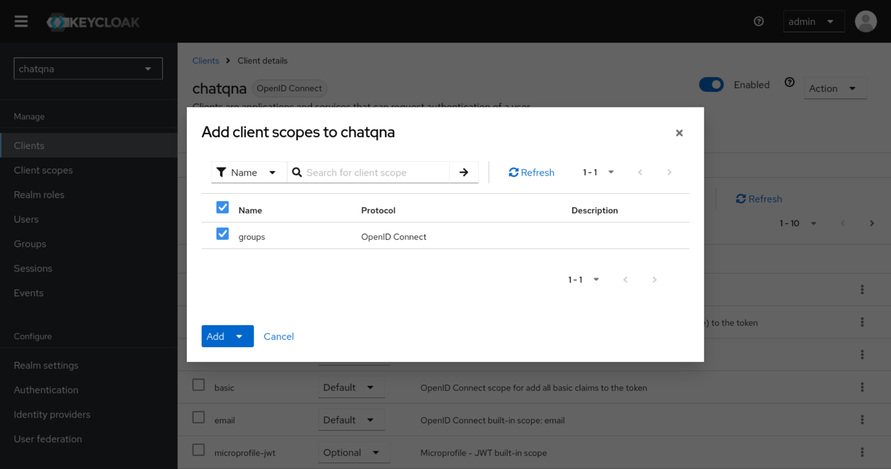

# Leveraging Istio to compose an OPEA Pipeline with authentication and authorization enabled

In enterprise settings not only do we want to identify who is using a service but also what they are entitled to use. This is where authentication and authorization comes in. In contrast, API tokens provide full access by virtue of possession as long as they are valid/not expired. With that aside, we first provide the solution on AuthN and AuthZ in OPEA using Istio and JWT tokens. Another option is to leverage the oauth2-proxy with various OIDC providers for authentication and authorization. Using oauth2-proxy with Istio ensures secure, scalable access control, centralizes user management, and provides seamless single sign-on capabilities, improving overall security and user experience in complex microservices environments.

Currently we provide three kinds of setups for authentication and authorization: via fake JWT token, via JWT token generated by OIDC providers and via oauth2-proxy and OIDC providers. And here we use the chatQnA pipeline as an example.

## Prerequisite

Before composing an OPEA pipeline with authN & authZ, user need to install Istio to support this feature. Please follow the steps [here](https://istio.io/latest/docs/setup/install/istioctl/) for Istio installation.

**Deploy chatQnA pipeline and enable Istio sidecar injection**

```sh

# deploy ChatQnA pipeline. You can either leverage GMC or the ChatQnA helm chart.
kubectl create ns chatqa
# here's the command to leverage GMC custom resource for ChatQnA deployment.
kubectl apply -f $(pwd)/../../microservices-connector/config/samples/ChatQnA/chatQnA_xeon.yaml
# please refer the doc https://github.com/opea-project/GenAIInfra/tree/main/helm-charts/chatqna for deployment with helm chart.
# and install under `chatqa` namespace

# expose an environment variable to set the deployment method
# which will affect the configuration we use for authentication and authorization
export DEPLOY_METHOD=<your deploy method, valid values: "gmc-based" and "helm-chart-based">

# patch the deployment to enable istio sidecar injection
# for GMC based deployment, set the `deployment-name` to `router-service-deployment`
# for helm chart based deployment, set the `deployment-name` to `chatqna`
kubectl patch deployment -n chatqa <deployment-name> --patch '{
  "spec": {
    "template": {
      "metadata": {
        "labels": {
          "sidecar.istio.io/inject": "true"
        }
      }
    }
  }
}'
```

The istio ingress gateway will be used to access the chatQnA service in different setups. Follow the istio guide [here](https://istio.io/latest/docs/tasks/traffic-management/ingress/ingress-control/#determining-the-ingress-ip-and-ports) to determine the ingress IP and ports and expose them as environment variables.

## Perform authentication and authorization via Bearer JWT tokens and curl

Authentication and authorization are essential for securing microservices architectures. Using Bearer JWT tokens for these processes ensures that only authenticated users with valid tokens can access specific services, protecting sensitive data. Authentication verifies user identity, while authorization controls their permissions. This layered approach not only prevents unauthorized access but also provides detailed control over service interactions, maintaining system security and compliance. Here we leverage Istio mechanisms together with Bearer JWT tokens to fulfill that.



### Perform authentication and authorization via fake JWT tokens

Here provides the case of authentication and authorization using fake JWT tokens. Fake JWT tokens are generated through a sample script provided by Istio community.

In this example, we setup rules that only users with JWT token issued by "testing@secure.istio.io" and with claim "groups" equal to "group1" can access the chatQnA workload.

**Apply authentication and authorization policies to the pipeline endpoint based on raw JWT tokens**

```sh
# make sure running under authN-authZ/auth-istio folder
# apply the yaml to request authentication using JWT token
kubectl apply -f $(pwd)/$DEPLOY_METHOD/chatQnA_authZ_fakejwt.yaml -n chatqa

# apply the yaml file to request that only JWT token with
# issuer & sub == "testing@secure.istio.io" and groups belongs to group1
# can access the endpoint of chatQnA service
kubectl apply -f $(pwd)/$DEPLOY_METHOD/chatQnA_authN_fakejwt.yaml -n chatqa
```

After applying these two yaml files, we have setup the policy that only user with a valid JWT token (with valid issuer and claims) could access the pipeline endpoint.

**Generate JWT tokens for testing**

Use the JWT tools provided by the Istio community to generate different JWT tokens to test the authentication and authorization cases.

Download the jwt tools and run the steps to generate tokens. Note: the JWT tool requires [python](https://www.python.org/downloads/) and [jwcrypto](https://pypi.org/project/jwcrypto/) as its dependency. Please download these if they didn't exist on your machine.

```sh
cd $(pwd)
wget --no-verbose https://raw.githubusercontent.com/istio/istio/release-1.22/security/tools/jwt/samples/gen-jwt.py
wget --no-verbose https://raw.githubusercontent.com/istio/istio/release-1.22/security/tools/jwt/samples/key.pem

# create an invalid jwt token with default issuer & sub = "testing@secure.istio.io" and claims=groups:group2
export TOKEN1=$(python3 -W ignore gen-jwt.py -claims=groups:group2 key.pem)

# create a valid jwt token with default issuer, sub and claims=groups:group1
export TOKEN2=$(python3 -W ignore gen-jwt.py -claims=groups:group1 key.pem)
```

**Validate authentication and authorization with different JWT tokens**

Deploy one client pod and test the chatQnA application with different tokens

```bash
kubectl create deployment client-test -n chatqa --image=python:3.8.13 -- sleep infinity

export CLIENT_POD=$(kubectl get pod -n chatqa -l app=client-test -o jsonpath={.items..metadata.name})

# export an accessUrl based on either GMC or helm chart based ChatQnA
if [ "${DEPLOY_METHOD}" = "gmc-based" ]; then
    export accessUrl=$(kubectl get gmc -n chatqa -o jsonpath="{.items[?(@.metadata.name=='chatqa')].status.accessUrl}")
else
    export accessUrl="http://chatqna.chatqa.svc.cluster.local:8888"

# try without token. Shall get response: "RBAC: access denied 403"
kubectl exec -it -n chatqa $CLIENT_POD -- curl -X POST $accessUrl -d '{"text":"What is the revenue of Nike in 2023?","parameters":{"max_new_tokens":17, "do_sample": true}}' -sS -H 'Content-Type: application/json' -w " %{http_code}\n"

# try with an invalid token. Shall get response: "RBAC: access denied 403"
kubectl exec -it -n chatqa $CLIENT_POD -- curl -X POST $accessUrl -d '{"text":"What is the revenue of Nike in 2023?","parameters":{"max_new_tokens":17, "do_sample": true}}' -sS -H "Authorization: Bearer $TOKEN1" -H 'Content-Type: application/json' -w " %{http_code}\n"

# try with the valid token. Shall get the correct response with http code
kubectl exec -it -n chatqa $CLIENT_POD -- curl -X POST $accessUrl -d '{"text":"What is the revenue of Nike in 2023?","parameters":{"max_new_tokens":17, "do_sample": true}}' -sS -H "Authorization: Bearer $TOKEN2" -H 'Content-Type: application/json' -w " %{http_code}\n"
```

### Perform authentication and authorization via JWT tokens generated by OIDC provider

An OpenID Connect (OIDC) provider is the service that can help handle authentication and authorization. It provides identity information for users in the form of ID tokens, which contain claims about the user's identity (like their name, email, and user ID). In this example, we choose Keycloak, which is an open source identity and access management project to add authentication to applications and secure services with minimum effort to generate and manage JWT tokens. User can select the OIDC providers including Github, Google, Azure and etc according to their needs.

In this sample, we are going to test with the scenario that only privileged users can access our chatQnA service and ask questions. In this case, user `mary` who has the role `user` can access the chatQnA pipeline. And user `bob` with the role `viewer` will not be able to access the service. Of course, the other users without valid token cannot access the service.

**Sample OIDC provider installation and configuration: Keycloak**

Install Keycloak in the kubernetes cluster for user management. **Note:** Replace the admin password as your own in the command.

```bash
# make sure running under authN-authZ/auth-istio folder
kubectl apply -f $(pwd)/keycloak_install.yaml

# get the ip and port to access keycloak.
export HOST_IP=$(kubectl config view --minify -o jsonpath='{.clusters[0].cluster.server}' | cut -d '/' -f3 | cut -d ':' -f1)
export KEYCLOAK_PORT=$(kubectl get svc keycloak -o jsonpath='{.spec.ports[0].nodePort}')
export KEYCLOAK_ADDR=${HOST_IP}:${KEYCLOAK_PORT}
```

**Note:** Double check if the host ip captured is the correct ip.

Access the Keycloak admin console through the `KEYCLOAK_ADDR` to configure the users. Use the username and password specified in the yaml file to login.

The user management is done via Keycloak and the configuration steps look like this:

1. Create a new realm named `istio` within Keycloak.

2. Create a new client called `istio` with default configurations.

3. From the left pane select the Realm roles and create a new role name as `user` and another new role as `viewer`.

4. Create a new user name as `mary` and another user as `bob`. Set passwords for both users (set 'Temporary' to 'Off'). Select Role mapping on the top, assign the `user` role to `mary` and assign the `viewer` role to `bob`.

**Apply authentication and authorization policies to the pipeline endpoint based on OIDC provider**

Use the commands to apply the authentication and authorization rules.

```bash
# export the router service through istio ingress gateway
kubectl apply -f $(pwd)/$DEPLOY_METHOD/chatQnA_router_gateway.yaml

# 'envsubst' is used to substitute envs in yaml.
# use 'sudo apt-get install gettext-base' to install envsubst if it does not exist on your machine
# apply the authentication and authorization rule
# these files will restrict user access with valid token (with valid issuer, username and realm role)
envsubst < $(pwd)/$DEPLOY_METHOD/chatQnA_authN_keycloak.yaml | kubectl -n chatqa apply -f -
envsubst < $(pwd)/$DEPLOY_METHOD/chatQnA_authZ_keycloak.yaml | kubectl -n chatqa apply -f -
```

User could customize the chatQnA_authZ_keycloak.yaml to reflect roles, groups or any other claims they defined in the OIDC provider for the user.

**Validate authentication and authorization with different JWT tokens**

Fetch access tokens for the two different users. **Note:** These commands are samples for Keycloak. And remember to replace the `password` in the curl url and turn off the all the 'Required actions' under the 'Authentication' section in Keycloak.

```bash
# get access token for mary. Please replace the password inside the url.
export TOKENA=$(curl -X POST 'http://${KEYCLOAK_ADDR}/realms/istio/protocol/openid-connect/token' -H 'Content-Type: application/x-www-form-urlencoded' --data-urlencode 'grant_type=password' --data-urlencode 'client_id=istio' --data-urlencode 'username=mary' -d 'password=${PASSWORD}' -d 'scope=openid' -d 'response_type=id_token' | jq -r .access_token)

# get access token for bob. Please replace the password inside the url.
export TOKENB=$(curl -X POST 'http://${KEYCLOAK_ADDR}/realms/istio/protocol/openid-connect/token' -H 'Content-Type: application/x-www-form-urlencoded' --data-urlencode 'grant_type=password' --data-urlencode 'client_id=istio' --data-urlencode 'username=bob' -d 'password=${PASSWORD}' -d 'scope=openid' -d 'response_type=id_token' | jq -r .access_token)
```

Access the istio ingress gateway to reach the chatQnA service with different tokens. Follow the istio guide [here](https://istio.io/latest/docs/tasks/traffic-management/ingress/ingress-control/#determining-the-ingress-ip-and-ports) to determine the ingress IP and ports.

```bash
# follow the guide above to fetch the $INGRESS_HOST and $INGRESS_PORT
export accessUrl="http://$INGRESS_HOST:$INGRESS_PORT"

# try without token. Shall get response: "RBAC: access denied 403"
curl -X POST $accessUrl -d '{"text":"What is the revenue of Nike in 2023?","parameters":{"max_new_tokens":17, "do_sample": true}}' -sS -H 'Content-Type: application/json' -w " %{http_code}\n"

# try with token of bob. Shall get response: "RBAC: access denied 403"
curl -X POST $accessUrl -d '{"text":"What is the revenue of Nike in 2023?","parameters":{"max_new_tokens":17, "do_sample": true}}' -sS -H "Authorization: Bearer $TOKENB" -H 'Content-Type: application/json' -w " %{http_code}\n"

# try with the valid token from mary. Shall get the correct response from LLM with http code
curl -X POST $accessUrl -d '{"text":"What is the revenue of Nike in 2023?","parameters":{"max_new_tokens":17, "do_sample": true}}' -sS -H "Authorization: Bearer $TOKENA" -H 'Content-Type: application/json' -w " %{http_code}\n"
```

## Perform authentication and authorization via oauth2-proxy and OIDC provider and UI

Another choice we have is using oauth2-proxy and OIDC providers. These two streamline authentication and authorization by handling user identity and access management. oauth2-proxy acts as a gateway, integrating with OIDC providers to authenticate users and issue tokens. This setup ensures secure access to applications by validating user credentials and managing permissions, simplifying the implementation of robust security protocols across services.



We are using a similar scenario here that only privileged users can access our chatQnA service and ask questions. In this case, user `mary` who has the role `user` can access the chatQnA pipeline. And user `bob` with the role `viewer` will not be able to access the service. Of course, the other users without valid token cannot access the service.

**Installation and configuration of oauth2-proxy and OIDC Provider**

Here we take Keycloak as the sample OIDC Provider to use in the example. Follow the steps to install and configure Keycloak.

```bash
# make sure running under authN-authZ/auth-istio folder
kubectl apply -f $(pwd)/keycloak_install.yaml

# get the ip and port to access keycloak.
export HOST_IP=$(kubectl config view --minify -o jsonpath='{.clusters[0].cluster.server}' | cut -d '/' -f3 | cut -d ':' -f1)
export KEYCLOAK_PORT=$(kubectl get svc keycloak -o jsonpath='{.spec.ports[0].nodePort}')
export KEYCLOAK_ADDR=${HOST_IP}:${KEYCLOAK_PORT}
```

**Note:** Double check if the host ip captured is the correct ip.

Access the Keycloak admin console through the `KEYCLOAK_ADDR` to configure the users as well as roles. Use the username and password specified in the yaml file to login.

The user management is done via Keycloak and the configuration steps look like this:

1. Create a new realm named `chatqna` within Keycloak.

   

2. Create a new client called `chatqna` and set `Client authentication` to 'On'. Set "http://chatqna-ui.com:${INGRESS_PORT}/*" in the `Valid redirect URIs` part. Note that `INGRESS_PORT` and `INGRESS_HOST` shall be exported following the guide [here](https://istio.io/latest/docs/tasks/traffic-management/ingress/ingress-control/#determining-the-ingress-ip-and-ports). Under the Credentials tab you will now be able to locate `<your client's secret>`, which will be used in the oauth2-proxy configs.

   

   

   

3. Access the dedicated mappers pane by clicking `<your client's id>-dedicated`, located under Assigned client scope to configure a new `Audience` mapper with name `aud-mapper-<your client's id>`. And include Audience in your client with `ID token` and `access token` set to `On`.

   

4. Create new roles `user` and `viewer` by navigating to `<your client's id> -> Roles`.

5. Create a new user name as `mary` and another user as `bob` with `Email verified` set to `On`. Set passwords for both users (set 'Temporary' to 'Off').

   

6. Create a new Client Scope with the name `groups` in Keycloak with `Include in Token Scope` set as `On`. Include a mapper of type `Group Membership` and set the `Token Claim Name` to `groups`. If the "Full group path" option is selected, you need to include a "/" separator in the group names defined in the --allowed-group option of OAuth2 Proxy. Example: "/groupname". After creating the Client Scope named `groups` you will need to attach it to your client. Go to Clients and find `<your client's id> -> Client scopes` and add client scope and select `groups` and choose `Optional` and you should now have a client that maps group memberships into the JWT tokens so that Oauth2 Proxy may evaluate them.

   

   

7. Create two groups `user` and `viewer` by navigating to Groups -> Create group. Assign role `user` to group `user` and role `viewer` to group `viewer` and add user `mary` as a member of group `user` and `bob` as a member of group `viewer`.

Next, we will install the oauth2-proxy and configure the OIDC information.

```bash
# set values for realm name, client name and ingress port
# then deploy oauth2-proxy
export REALM=<YOUR_REALM_NAME>
export CLIENT=<YOUR_CLIENT_NAME>
export CLIENT_SECRET=<YOUR_CLIENT_SECRET>
# generate cookie secret
# Using bash here. More methods found here:
# https://oauth2-proxy.github.io/oauth2-proxy/configuration/overview#generating-a-cookie-secret
export COOKIE_SECRET=$(dd if=/dev/urandom bs=32 count=1 2>/dev/null | base64 | tr -d -- '\n' | tr -- '+/' '-_' ; echo)
kubectl create ns oauth2-proxy
envsubst < $(pwd)/oauth2_install.yaml | kubectl apply -f -
```

**Expose the pipeline endpoint through Istio Ingressgateway and install chatQnA UI**

Here we expose the chatQnA endpoint through the ingress gateway and then install the chatQnA conversation UI.

```bash
# expose chatqna endpoint
kubectl apply -f $(pwd)/$DEPLOY_METHOD/chatQnA_router_gateway_oauth.yaml
# build chatqna UI image if not exist on your machine
git clone https://github.com/opea-project/GenAIExamples.git
cd GenAIExamples/ChatQnA/docker/ui/
docker build --no-cache -t opea/chatqna-conversation-ui:latest --build-arg https_proxy=$https_proxy --build-arg http_proxy=$http_proxy -f ./docker/Dockerfile.react .
# inject image to containerd repo
docker save -o ui.tar opea/chatqna-conversation-ui:latest
sudo ctr -n k8s.io image import ui.tar
# install chatqna conversation UI
cd && cd GenAIInfra
if [ "${DEPLOY_METHOD}" = "gmc-based" ]; then
    helm install chatqna-ui $(pwd)/helm-charts/common/chatqna-ui --set BACKEND_SERVICE_ENDPOINT="http://chatqna-service.com:${INGRESS_PORT}/",DATAPREP_SERVICE_ENDPOINT="http://chatqna-service.com:${INGRESS_PORT}/dataprep"
else
    helm install chatqna-ui $(pwd)/helm-charts/common/chatqna-ui --set BACKEND_SERVICE_ENDPOINT="http://chatqna-service.com:${INGRESS_PORT}/v1/chatqna",DATAPREP_SERVICE_ENDPOINT="http://chatqna-service.com:${INGRESS_PORT}/v1/dataprep"
fi
# expose ui service outside
kubectl apply -f $(pwd)/chatQnA_ui_gateway.yaml
```

**Add authentication and authorization rules to the pipeline through Istio Ingress Gateway**

Here we apply the authentication and authorization rules.

```bash
# Before applying the authorization rule, need to add the oauth2-proxy as the external authorization provider
kubectl apply -f $(pwd)/chatQnA_istio_external_auth.yaml
kubectl rollout restart deployment/istiod -n istio-system
# 'envsubst' is used to substitute envs in yaml.
# use 'sudo apt-get install gettext-base' to install envsubst if it does not exist on your machine
# apply the authentication and authorization rule
# these files will restrict user access with valid token (with valid group and role)
envsubst < $(pwd)/chatQnA_authN_oauth.yaml | kubectl apply -f -
envsubst < $(pwd)/chatQnA_authZ_oauth.yaml | kubectl apply -f -
```

**Validate authentication and authorization with UI service**

Add both host names for ChatQnA UI and backend service into /etc/hosts

```bash
sudo sed -i '1i\127.0.0.1       chatqna-service.com' /etc/hosts
sudo sed -i '1i\127.0.0.1       chatqna-ui.com' /etc/hosts
```

Open browser with address "chatqna-ui.com:${INGRESS_PORT}". Login with user `bob` and its credentials shall return a 403 error. Login with user `mary` and its credentials shall able to access the ChatQnA service.
