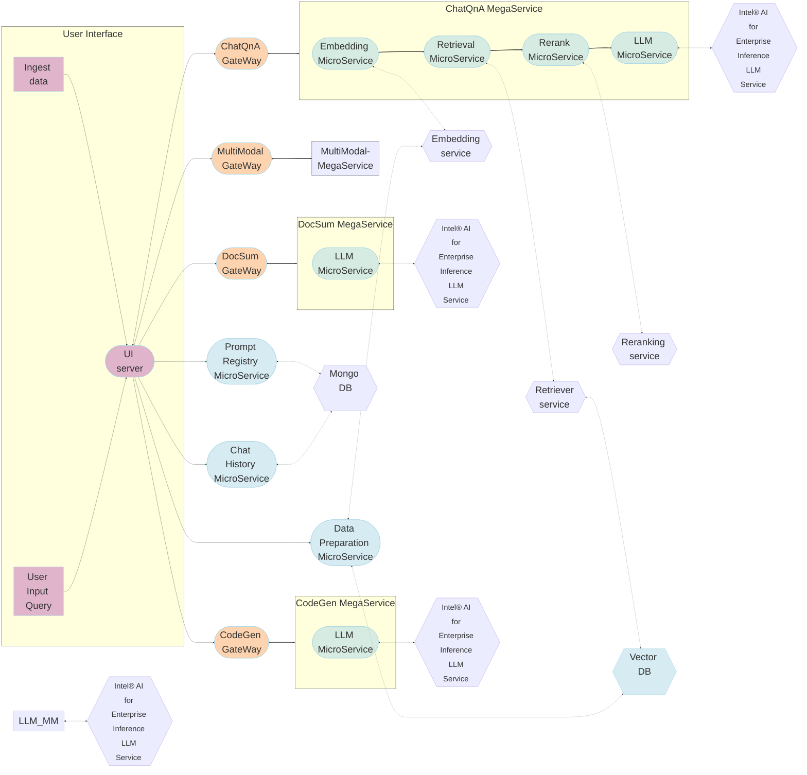

# OPEA Productivity Suite for IBM Cloud VPC via Intel® AI for Enterprise Inference

A Terraform module for deploying the OPEA (Open Platform for Enterprise AI) Productivity Suite on IBM Cloud VPC infrastructure. This solution provides a comprehensive set of AI-powered productivity tools built on top of secure, scalable, and OpenAI-compliant LLM endpoints generated by Intel® AI for Enterprise Inference, enabling enterprises to leverage generative AI capabilities for document processing, code generation, and a conversational assistant.

## Overview

The OPEA Productivity Suite deploys a collection of microservices that provide various AI-powered capabilities:

- **ChatQnA**: Conversational AI with document retrieval capabilities (RAG)
- **DocSum**: Document summarization service
- **CodeGen**: AI-powered code generation and assistance
- **Authentication**: Integrated Keycloak for identity and access management

The deployment is fully automated using Terraform and Helm, allowing for consistent and repeatable deployments across environments. This module handles both the infrastructure provisioning (IBM Cloud VPC and Kubernetes Service) and application deployment.

## Quick Start

1. Clone this repository
2. Configure your IBM Cloud credentials
3. Set required variables in `terraform.tfvars`
4. Initialize and apply the Terraform configuration:

```bash
terraform init
terraform apply
```

## Prerequisites

- IBM Cloud account
- IBM Cloud API key
- Terraform ≥ 1.0.0
- Access to Intel-based virtual servers

- Helm Charts from opea-project/GenAIInfra v1.2 (Provided in the module)

## Architecture



The solution architecture consists of two main layers:

### Infrastructure Layer

- IBM Cloud VPC with public and private subnets
- IBM Kubernetes Service (IKS) cluster deployed within the VPC
- Storage volumes for persistent data
- Load balancers for service exposure

### Application Layer

The OPEA Productivity Suite follows a microservices architecture with these key components:

1. **UI Layer**: Unified interface for all services
2. **Gateway Layer**: Central ingress with authentication
3. **Megaservices**:
   - **ChatQnA**: Conversational AI with RAG capabilities
   - **DocSum**: Document summarization
   - **CodeGen**: Code generation assistance
4. **Shared Infrastructure**:
   - Keycloak for authentication
   - Vector databases for document retrieval
   - MongoDB for data persistence

Each megaservice comprises multiple specialized microservices:

### ChatQnA Components

- LLM Service
- Embedding Service
- Retriever Service
- Reranking Service

### DocSum Components

- Document Processing
- Summarization Service

### CodeGen Components

- Code Understanding
- LLM Code Generation

## Modules

The solution includes the following Terraform modules:

- `ibm-cloud-vpc`: Provisions the IBM Cloud VPC infrastructure and IKS cluster
- `chatqna`: Deploys the ChatQnA megaservice
- `codegen`: Deploys the CodeGen megaservice
- `docsum`: Deploys the DocSum megaservice
- 'chathistory': Deploys the chathistory service
- 'prompt': Deploys the prompt registry service

Supporting infrastructure:

- Keycloak: Identity and access management
- Nginx: Central gateway for all services
- UI: Unified user interface

## Resource Requirements

The infrastructure provisioning creates IBM Cloud VPC resources with the following specifications:

- **Compute**: Intel-based virtual servers (recommended: 32+ vCPU cores)
- **Memory**: Minimum 64GB RAM for full deployment
- **Storage**: 100GB+ for model storage
- **Networking**: VPC with public and private subnets
- **Kubernetes**: IBM Kubernetes Service (IKS) cluster with worker nodes provisioned in the VPC

## Inputs

### Core Infrastructure Variables

| Name                                        | Description                            | Type   | Required |
| ------------------------------------------- | -------------------------------------- | ------ | :------: |
| ibmcloud_api_key                            | IBM Cloud API key                      | string |   yes    |
| HuggingFace Token                           | HF Token with access to desired models | string |   yes    |
| Intel® AI for Enterprise Inference API Key | API Keys for LLM endpoints             | string |   yes    |
| email                                       | IBM Cloud email address                | string |    no    |
| region                                      | IBM Cloud region                       | string |   yes    |
| vpc_name                                    | Name of the VPC to create              | string |   yes    |
| cluster_name                                | Name of the IKS cluster                | string |   yes    |
| worker_count                                | Number of worker nodes                 | number |   yes    |
| machine_type                                | Worker node instance profile           | string |   yes    |
| cluster_version                             | Kubernetes version for IKS cluster     | string |   yes    |

### Application Variables

| Name                         | Description                             | Type   | Required |
| ---------------------------- | --------------------------------------- | ------ | :------: |
| chatqna_model_dir            | Directory path for ChatQNA models       | string |   yes    |
| chatqna_helm_chart_path      | Path to the ChatQNA Helm chart          | string |   yes    |
| chatqna_model_name           | Name of the main ChatQNA model          | string |   yes    |
| chatqna_embedding_model_name | Name of the embedding model for ChatQNA | string |   yes    |
| chatqna_reranker_model_name  | Name of the reranker model for ChatQNA  | string |   yes    |
| chatqna_llm_service_host_ip  | LLM Service Host IP for ChatQNA         | string |   yes    |
| codegen_model_dir            | Directory path for Codegen models       | string |   yes    |
| codegen_helm_chart_path      | Path to the Codegen Helm chart          | string |   yes    |
| codegen_model_name           | Name of the Codegen model               | string |   yes    |
| codegen_llm_service_host_ip  | LLM Service Host IP for Codegen         | string |   yes    |
| docsum_model_dir             | Directory path for Docsum models        | string |   yes    |
| docsum_helm_chart_path       | Path to the Docsum Helm chart           | string |   yes    |
| docsum_model_name            | Name of the Docsum model                | string |   yes    |
| docsum_llm_service_host_ip   | LLM Service Host IP for Docsum          | string |   yes    |
| nginx_helm_chart_path        | Path to the Nginx Helm chart            | string |   yes    |
| ui_helm_chart_path           | Path to the UI Helm chart               | string |   yes    |

## Outputs

### Infrastructure Outputs

| Name                     | Description                           |
| ------------------------ | ------------------------------------- |
| vpc_id                   | ID of the created VPC                 |
| cluster_id               | ID of the provisioned IKS cluster     |
| cluster_endpoint         | API endpoint URL for the IKS cluster  |
| cluster_ingress_hostname | Ingress hostname for the IKS cluster  |
| kubeconfig_path          | Path to the generated kubeconfig file |

### Application Outputs

| Name              | Description                         |
| ----------------- | ----------------------------------- |
| keycloak_endpoint | LoadBalancer endpoint for Keycloak  |
| ui_endpoint       | UI Service Endpoint                 |
| deployment_status | Status of all deployments           |
| chatqna_namespace | Namespace where ChatQnA is deployed |
| codegen_namespace | Namespace where CodeGen is deployed |
| docsum_namespace  | Namespace where DocSum is deployed  |

## Configuration Options

### Infrastructure Configuration

The IBM Cloud VPC and IKS infrastructure can be customized through:

- Region and zone selection
- VPC networking configuration
- Worker node machine types and counts
- Storage class and capacity options
- Kubernetes version selection

### Application Configuration

The application deployment can be customized through various feature flags:

- Enable/disable specific components (UI, Embedding, Re-ranking etc.)
- Configure model sources and endpoints
- Set authentication parameters
- Customize resource allocation

## Security Considerations

### Infrastructure Security

- VPC security groups automatically configured to restrict network access
- Private subnets used for worker nodes with controlled ingress/egress
- Kubernetes RBAC enabled by default
- IBM cloud IAM integration for cluster access control

### Application Security

- Keycloak is configured with default admin credentials (should be changed in production)
- Access to services is protected through authentication
- Network policies applied to restrict pod-to-pod communication
- For production deployments, consider using a certificate manager for TLS
