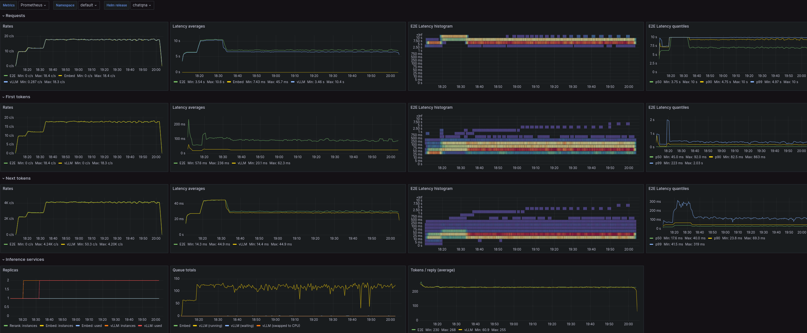
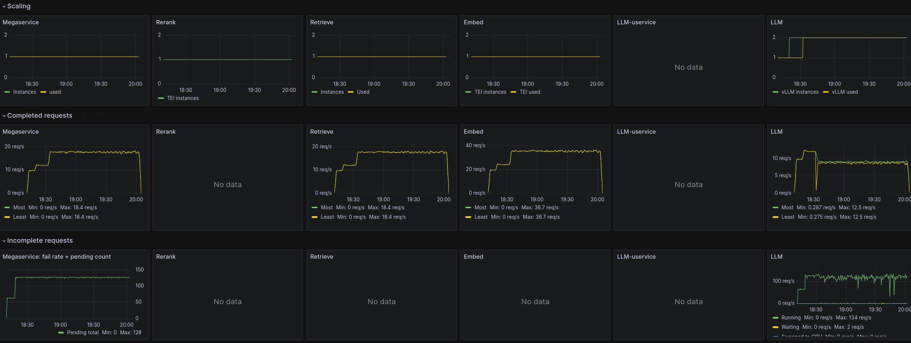

# Observability for OPEA Workloads in Kubernetes

## Table of Contents

- [Introduction](#introduction)
- [Pre-conditions](#pre-conditions)
  - [Prometheus + Grafana install](#prometheus--grafana-install)
  - [OPEA Helm options](#opea-helm-options)
- [Install](#install)
  - [Monitoring support + Grafana access](#monitoring-support--grafana-access)
  - [Dashboards](#dashboards)
- [Verify](#verify)
- [Dashboards](#dashboards)

## Introduction

Helm chart `monitoring` option enables observability support for the OPEA workloads;
[Prometheus](https://prometheus.io/) metrics for the service components,
and [Grafana](https://grafana.com/) visualization for them.

Scaling the services automatically based on their usage with [HPA](HPA.md) also relies on these metrics.

[Metrics / visualization add-ons](../kubernetes-addons/Observability/README.md)
explains how to install additional monitoring for node and device metrics,
and Grafana for visualizing those metrics.

## Pre-conditions

### Prometheus + Grafana install

If cluster does not run [Prometheus operator](https://github.com/prometheus-operator/kube-prometheus)
yet, it SHOULD be be installed before enabling monitoring, e.g. by using a Helm chart for it:
https://github.com/prometheus-community/helm-charts/tree/main/charts/kube-prometheus-stack

To install (older 55.x version) of Prometheus & Grafana:

```console
$ helm repo add prometheus-community https://prometheus-community.github.io/helm-charts
$ helm repo update
$ prom_ns=monitoring  # namespace for Prometheus
$ kubectl create ns $prom_ns
$ helm install prometheus-stack prometheus-community/kube-prometheus-stack --version 55.5.2 -n $prom_ns
```

### OPEA Helm options

If Prometheus & Grafana are installed under some other release name than `prometheus-stack`,
provide that as `global.prometheusRelease` value for the OPEA service Helm install,
or in its `values.yaml` file. Otherwise Prometheus ignores the installed
`serviceMonitor` objects.

## Install

### Monitoring support + Grafana access

Install (e.g. ChatQnA) Helm chart with `--set global.monitoring=true` option.

Use port-forward to access Grafana

```
kubectl port-forward service/grafana 3000:80
```

Open your browser and navigate to http://localhost:3000. Use
"admin/prom-operator" as the username and the password to login.

### Dashboards

Currently, when `monitoring` option is enabled for ChatQnA and DocSum
Helm charts, also OPEA application monitoring dashboard is installed:



When [HPA scaling](HPA.md) is enabled, additional application scaling
dashboard is installed:



For other applications, if they were installed with `monitoring`
option enabled, dashboard(s) for monitoring them can be installed
afterwards, with:

```
$ helm install dashboards dashboards/ --set global.monitoring=true
```

NOTE: dashboards will list available applications and their metrics
only after they've processed their first token, because related
metrics are not available before that!

## Verify

Check installed Prometheus service names:

```console
$ prom_ns=monitoring  # Prometheus namespace
$ kubectl -n $prom_ns get svc
```

(Object names depend on whether Prometheus was installed from manifests, or Helm,
and the release name given for its Helm install.)

Use service name matching your Prometheus installation:

```console
$ prom_svc=prometheus-stack-kube-prom-prometheus  # Metrics service
```

Verify Prometheus found metric endpoints for chart services, i.e. last number on `curl` output is non-zero:

```console
$ chart=chatqna # OPEA chart release name
$ prom_url=http://$(kubectl -n $prom_ns get -o jsonpath="{.spec.clusterIP}:{.spec.ports[0].port}" svc/$prom_svc)
$ curl --no-progress-meter $prom_url/metrics | grep scrape_pool_targets.*$chart
```

Then check that Prometheus metrics from a relevant LLM inferencing service are available.

For vLLM:

```console
$ curl --no-progress-meter $prom_url/api/v1/query? \
  --data-urlencode 'query=vllm:cache_config_info{service="'$chart'-vllm"}' | jq
```

Or TGI:

```console
$ curl --no-progress-meter $prom_url/api/v1/query? \
  --data-urlencode 'query=tgi_queue_size{service="'$chart'-tgi"}' | jq
```

**NOTE**: inferencing services provide metrics only after they've processed their first request.
And reranking service only after query context data has been uploaded!
