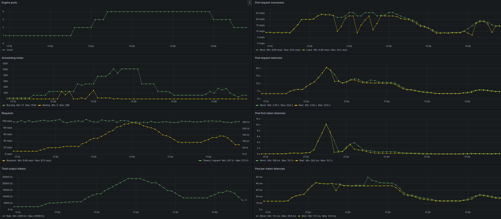
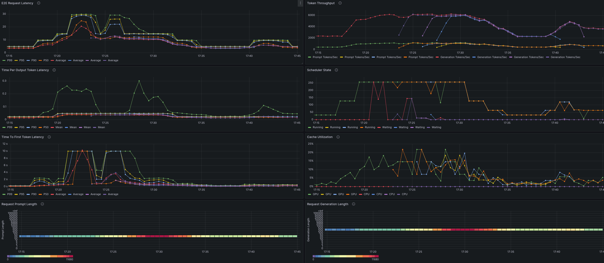

# KubeAI for OPEA

[KubeAI](https://www.kubeai.org) is an open-source AI inferencing operator. This folder contains documentation, installation instructions and deployment files for running KubeAI with OPEA inference services.

For now, OPEA enables a subset of the KubeAI features. In the future more KubeAI service will be added.

- [KubeAI for OPEA](#kubeai-for-opea)
  - [Features](#features)
- [Installation](#installation)
  - [Prerequisites](#prerequisites)
  - [Install KubeAI](#install-kubeai)
- [Deploying the Models](#deploying-the-models)
  - [Text Generation with Llama-3 on CPU](#text-generation-with-llama-3-on-cpu)
  - [Text Generation with Llama-3 on Gaudi](#text-generation-with-llama-3-on-gaudi)
  - [Text Embeddings with BGE on CPU](#text-embeddings-with-bge-on-cpu)
- [Using the Models](#using-the-models)
- [Observability](#observability)

## Features

The following features are available at the moment.

- OpenAI APIs - tested/working
- OPEA Gaudi and CPU support - tested/working
- Persistent Volume cache for models - tested/working
- Model downloading & inference engine deployment - tested/working
- Scaling pods to/from zero - tested/working
- Load based autoscaling - tested/working
- Integration with OPEA application - missing
- Observability - tested/working

The following models are included.

- Text generation model (llama-3.1-8b) for vLLM (CPU and Gaudi)
- Text generation model (llama-3.3-70b) for vLLM (Gaudi)
- Text embedding model (BAII/BGE) for vLLM (CPU)
- Text generation model (qwen-2.5-0.5b) for OLlama (CPU)

# Installation

## Prerequisites

- Kubernetes cluster
- Helm
- HF_TOKEN ([HuggingFace](https://huggingface.co/docs/hub/security-tokens)) token
- Dynamic Volume Provisioning (optional)
- Nodes with Gaudi accelerator (optional)

## Install KubeAI

The following commands will install KubeAI to `kubeai` namespace.

```
helm repo add kubeai https://www.kubeai.org
helm repo update
export HF_TOKEN=<your-hugging-face-token> # optionally, pass token file to the script
./install.sh
```

After the installation you should have the following pods running.

```
kubeai-84c999c967-5bdps                              1/1     Running   0          147m
open-webui-0                                         1/1     Running   0          152m
```

You should also have KubeAI CRD installed. You can verify this by running the following commands.

```
kubectl get crd models.kubeai.org
kubectl explain models.kubeai.org
```

# Deploying the Models

This section describes how to deploy various models. All the examples below use Kubernetes Persistent Volumes and Claims (PV/PVC) to store the models. The Kubernetes Storage Class (SC) is called `standard`. You can tune the storage configuration to match your environment during the installation (see `cacheProfiles` in `opea-values.yaml`).

The models in the examples below are deployed to `$NAMESPACE`. Please set that according to your needs.

```
export NAMESPACE="kubeai"
kubectl create namespace $NAMESPACE
```

## Text Generation with Llama-3 on CPU

The following command will deploy the `Meta-Llama-3.1-8B-Instruct` model with vLLM engine using CPU.

```
kubectl apply -f models/llama-3.1-8b-instruct-cpu.yaml -n $NAMESPACE
```

The deployment will first create a Kubernetes job, which will download the model to a Persistent Volume (PV).

After the model is downloaded the job is completed and the model server is started. You can verify the model server is running by running the following command.

```
 kubectl get pod -n $NAMESPACE
```

You should see a pod running with the name `model-llama-3.1-8b-instruct-cpu-xxxx`.

## Text Generation with Llama-3 on Gaudi

The following commands will deploy `Meta-Llama-3.1-8B-Instruct` and `Meta-Llama-3.3-70B-Instruct` models with the vLLM engine using Gaudi accelerators.

```
# Meta-Llama-3.1-8B-Instruct model
kubectl apply -f models/llama-3.1-8b-instruct-gaudi.yaml -n $NAMESPACE
# Meta-Llama-3.3-70B-Instruct model
kubectl apply -f models/llama-3.3-70b-instruct-gaudi.yaml -n $NAMESPACE
```

The rest is the same as in the previous example. You should see a pod running with the name `model-llama-3.1-8b-instruct-gaudi-xxxx`. When request load for that model increases enough, KubeAI will automatically deploy more instances (model `maxReplicas` > `minReplicas`).

Latter model is set to scale from zero (`minReplicas` = 0), so `model-llama-3.3-70b-instruct-gaudi-xxxx` pod(s) will be present only when KubeAI gets requests for that model (avoids multiple devices being exclusively reserved for idle pods, but significantly slows down first response).

## Text Embeddings with BGE on CPU

The following command will deploy the `BAAI/bge-base-en-v1.5` model with vLLM engine using CPU.

```
kubectl apply -f models/bge-embed-text-cpu.yaml -n $NAMESPACE
```

The rest is the same as in the previous example. You should see a pod running with the name `model-bge-embed-text-cpu-xxxx`.

# Using the Models

Assuming you don’t have any ingress gateway available, you can use the below `kubectl port-forward` command to access the models you have deployed.

```
kubectl port-forward svc/kubeai -n kubeai 8000:80
```

Query the models available:

```
curl localhost:8000/openai/v1/models
```

Depending on your configuration you should have something like this as an answer to the above command.

```
{
  "object": "list",
  "data": [
    {
      "id": "llama-3.1-8b-instruct-gaudi",
      "created": 1743594352,
      "object": "model",
      "owned_by": "",
      "features": [
        "TextGeneration"
      ]
    },
  ]
}
```

Use the following command to query the model.

```
curl "http://localhost:8000/openai/v1/chat/completions" \
    -H "Content-Type: application/json" \
    -d '{
        "model": "llama-3.1-8b-instruct-gaudi",
        "messages": [
            {
                "role": "system",
                "content": "You are a helpful assistant."
            },
            {
                "role": "user",
                "content": "What should I do in Finland during the winter time?"
            }
        ]
    }'

```

Enjoy the answer!

# Observability

With [Prometheus](../helm-charts/monitoring.md) running, install script can enable monitoring of the vLLM inference engine instances.

Script requires Prometheus Helm chart release name for that, e.g.

```
release=prometheus-stack
./install.sh $release
```

Port-forward Grafana.

```
kubectl port-forward -n $ns svc/$release-grafana 3000:80
```

Install "vLLM scaling" and "vLLM details" dashboards, to the same namespace as Grafana.

```
ns=monitoring
kubectl apply -n $ns -f grafana/vllm-scaling.yaml -f grafana/vllm-details.yaml
```

Open web-browser to `http://localhost:3000` with `admin` / `prom-operator` given as the username / password for login, to view the dashboards.

Both dashboards filter the viewed vLLM instances by the selected namespace (e.g. `kubeai`) and the model they use.

The scaling dashboard shows trends both for sum of metrics across all these instances, as well as the best and worst per-instance metric values at a given moment.


Whereas details dashboard shows more detailed engine metrics for the selected vLLM instance (or all of them).


Note:

- Dashboards should be visible in Grafana within a minute of them being applied, but
- vLLM metrics will be available only after the first inference request has been processed
