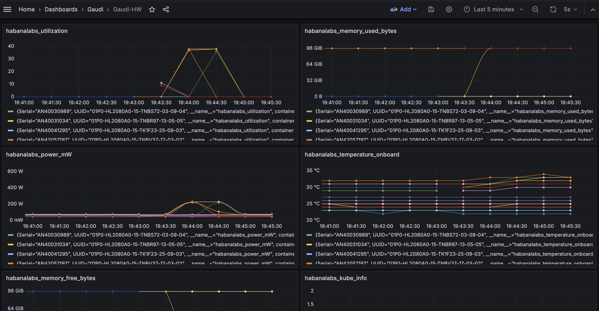
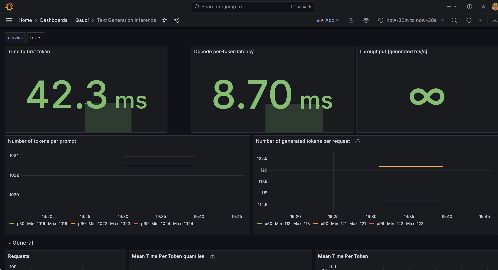
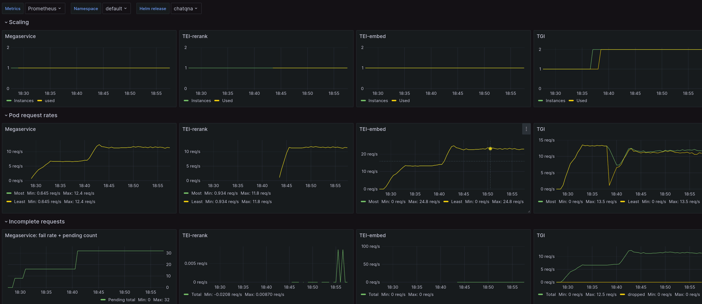
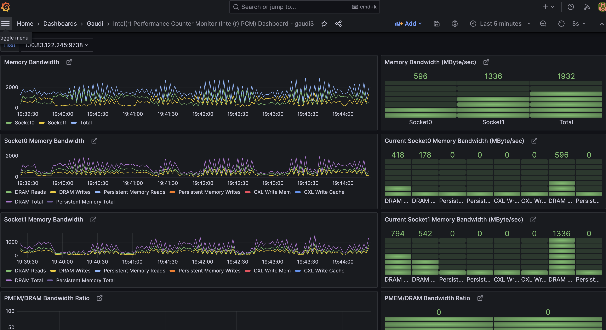

# How-To Setup Observability for OPEA Workload in Kubernetes

This guide provides a step-by-step approach to setting up observability for the OPEA workload in a Kubernetes environment. We will cover the setup of Prometheus and Grafana, as well as the collection of metrics for Gaudi hardware, OPEA/chatqna including TGI, TEI-Embedding, TEI-Reranking and other microservices, and PCM.

For monitoring Helm installed OPEA applications, see [Helm monitoring option](../../helm-charts/monitoring.md).

## Prepare

```
git clone https://github.com/opea-project/GenAIInfra.git
cd kubernetes-addons/Observability
```

## 1. Setup Prometheus & Grafana

Setting up Prometheus and Grafana is essential for monitoring and visualizing your workloads. Follow these steps to get started:

### Step 1: Install Prometheus&Grafana

```
kubectl create ns monitoring
helm repo add prometheus-community https://prometheus-community.github.io/helm-charts
helm repo update
helm install prometheus-stack prometheus-community/kube-prometheus-stack --version 55.5.1 -n monitoring
```

### Step 2: Verify the installation

```
kubectl get pods -n monitoring
```

### Step 3: Port-forward to access Grafana

```
kubectl port-forward service/grafana 3000:80
```

### Step 4: Access Grafana

Open your browser and navigate to http://localhost:3000. Use "admin/prom-operator" as the username and the password to login.

## 2. Metrics for Gaudi Hardware (v1.16.2)

To monitor Gaudi hardware metrics, you can use the following steps:

### Step 1: Install daemonset

```
kubectl create -f https://vault.habana.ai/artifactory/gaudi-metric-exporter/yaml/1.16.2/metric-exporter-daemonset.yaml
```

### Step 2: Install metric-exporter

```
kubectl create -f https://vault.habana.ai/artifactory/gaudi-metric-exporter/yaml/1.16.2/metric-exporter-service.yaml
```

### Step 3: Install service-monitor

```
kubectl apply -f ./habana/metric-exporter-serviceMonitor.yaml
```

### Step 4: Verify the metrics

```
# To get the metric endpoints, e.g. to get first endpoint to test
habana_metric_url=`kubectl -n monitoring get ep metric-exporter -o jsonpath="{.subsets[].addresses[0].ip}:{..subsets[].ports[0].port}"`
# Fetch the metrics
curl ${habana_metric_url}/metrics

# you will see the habana metric data  like this:
process_resident_memory_bytes 2.9216768e+07
# HELP process_start_time_seconds Start time of the process since unix epoch in seconds.
# TYPE process_start_time_seconds gauge
process_start_time_seconds 1.71394960963e+09
# HELP process_virtual_memory_bytes Virtual memory size in bytes.
# TYPE process_virtual_memory_bytes gauge
process_virtual_memory_bytes 2.862641152e+09
# HELP process_virtual_memory_max_bytes Maximum amount of virtual memory available in bytes.
# TYPE process_virtual_memory_max_bytes gauge
process_virtual_memory_max_bytes 1.8446744073709552e+19
# HELP promhttp_metric_handler_requests_in_flight Current number of scrapes being served.
# TYPE promhttp_metric_handler_requests_in_flight gauge
promhttp_metric_handler_requests_in_flight 1
# HELP promhttp_metric_handler_requests_total Total number of scrapes by HTTP status code.
# TYPE promhttp_metric_handler_requests_total counter
promhttp_metric_handler_requests_total{code="200"} 125
promhttp_metric_handler_requests_total{code="500"} 0
promhttp_metric_handler_requests_total{code="503"} 0
```

### Step 5: Import the dashboard into Grafana

Manually import the [`Dashboard-Gaudi-HW.json`](./habana/Dashboard-Gaudi-HW.json) file into Grafana


## 3. Metrics for OPEA applications

To monitor OPEA application metrics including TGI-gaudi, TEI, TEI-Reranking and other micro services, you can use the following steps:

### Step 1: Install application with Helm

Install Helm (version >= 3.15) first. Refer to the [Helm Installation Guide](https://helm.sh/docs/intro/install/) for more information.

Install OPEA application as described in [Helm charts README](../../helm-charts/README.md).

For example, to install ChatQnA, follow [ChatQnA helm chart](https://github.com/opea-project/GenAIInfra/tree/main/helm-charts/chatqna/README.md) for instructions on deploying it to Kubernetes.

Make sure to enable [Helm monitoring option](../../helm-charts/monitoring.md).

### Step 2: Install dashboards

Here are few Grafana dashboards for monitoring different aspects of OPEA applications:

- [`queue_size_embedding_rerank_tgi.json`](./chatqna/dashboard/queue_size_embedding_rerank_tgi.json): queue size of TGI-gaudi, TEI-Embedding, TEI-reranking
- [`tgi_grafana.json`](./chatqna/dashboard/tgi_grafana.json): `tgi-gaudi` text generation inferencing service utilization
- [`opea-scaling.json`](./opea-apps/opea-scaling.json): scaling, request rates and failures for OPEA application megaservice, TEI-reranking, TEI-embedding, and TGI

You can either:

- Import them manually to Grafana,
- Use [`update-dashboards.sh`](./update-dashboards.sh) script to add them to Kubernetes as Grafana dashboard configMaps
  - (Script assumes Prometheus / Grafana to be installed according to above instructions)
- Or create your own dashboards based on them

Note: when dashboard is imported to Grafana, you can directly save changes to it, but those dashboards go away if Grafana is removed / re-installed.

Whereas with dashboard configMaps, Grafana saves changes to a selected file, but you need to remember to re-apply them to Kubernetes / Grafana, for your changes to be there when that dashboard is reloaded.




## 4. Metrics for PCM (Intel® Performance Counter Monitor)

### Step 1: Install PCM

Please refer to this repo to install [Intel® PCM](https://github.com/intel/pcm)

### Step 2: Modify & Install pcm-service

modify the `pcm/pcm-service.yaml` file to set the addresses

```
kubectl apply -f pcm/pcm-service.yaml
```

### Step 3: Install PCM serviceMonitor

```
kubectl apply -f pcm/pcm-serviceMonitor.yaml
```

### Step 4: Install the PCM dashboard

manually import the [`pcm-dashboard.json`](./pcm/pcm-dashboard.json) file into the Grafana


## More dashboards

GenAIEval repository includes additional [dashboards](https://github.com/opea-project/GenAIEval/tree/main/evals/benchmark/grafana).
