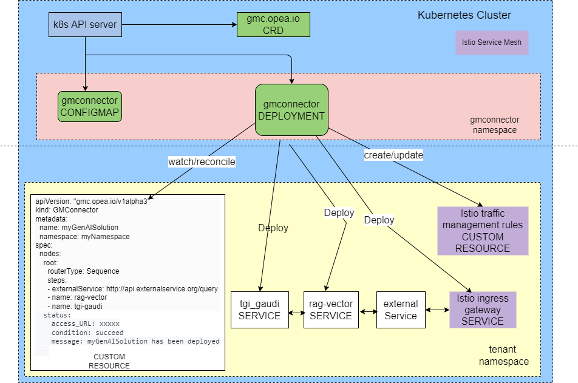
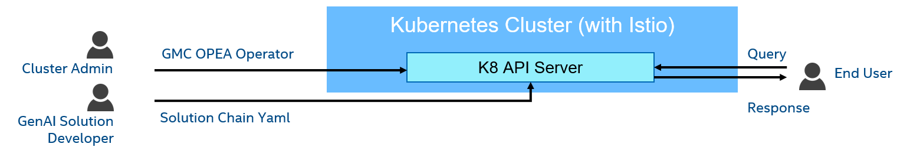

# genai-microservices-connector(GMC)

This repo defines the GenAI Microservice Connector(GMC) for OPEA projects. GMC can be used to compose and adjust GenAI pipelines dynamically
on kubernetes. It can leverage the microservices provided by [GenAIComps](https://github.com/opea-project/GenAIComps) and external services to compose GenAI pipelines. External services might be running in a public cloud or on-prem by providing an URL and access details such as an API key and ensuring there is network connectivity. It also allows users to adjust the pipeline on the fly like switching to a different Large language Model(LLM), adding new functions into the chain(like adding guardrails),etc. GMC supports different types of steps in the pipeline, like sequential, parallel and conditional.

Please refer this [usage_guide](./usage_guide.md) for sample use cases.

## Description

The GenAI Microservice Connector(GMC) contains the CustomResourceDefinition(CRD) and its controller to bring up the services needed for a GenAI application.
Istio Service Mesh can also be leveraged to facilicate communication between microservices in the GenAI application.

## Architecture



## Personas



## Getting Started

**CRD** defines are at config/crd/bases/  
**API** is api/v1alpha3/  
**Controller** is at internal/controller

### Prerequisites

- Access to a Kubernetes v1.11.3+ cluster.

### Introduction

There are `2` components in this repo:

- 1. `manager`: controller manager to handle GMC CRD
- 2. `router`: route the traffic among the microservices defined in GMC

#### How to build these binaries?

```sh
make build
```

#### How to build docker images for these 2 components?

```sh
make docker.build
```

#### How to delete these components' binaries?

```sh
make clean
```

### To Deploy on the cluster

**Build and push your image to the location specified by `CTR_IMG`:**

```sh
make docker.build docker.push CTR_IMG=<some-registry>/gmcmanager:tag
```

**NOTE:** This image ought to be published in the personal registry you specified.
And it is required to have access to pull the image from the working environment.
Make sure you have the proper permission to the registry if the above commands don’t work.

**Install GMC CRD**

```sh
kubectl apply -f config/crd/bases/gmc.opea.io_gmconnectors.yaml
```

**Get related manifests for GenAI Components**

```sh
mkdir -p $(pwd)/config/manifests
cp $(dirname $(pwd))/manifests/ChatQnA/*.yaml -p $(pwd)/config/manifests/
```

**Copy GMC router manifest**

```sh
cp $(pwd)/config/gmcrouter/gmc-router.yaml -p $(pwd)/config/manifests/
```

**Create ConfigMap for GMC to hold GenAI Components and GMC Router manifests**

```sh
kubectl create configmap gmcyaml -n $SYSTEM_NAMESPACE --from-file $(pwd)/config/manifests
```

**NOTE:** The configmap name `gmcyaml' is defined in gmcmanager deployment Spec. Please modify accordingly if you want
use a different name for the configmap.

**Install GMC manager**

```sh
kubectl apply -f $(pwd)/config/rbac/gmc-manager-rbac.yaml
kubectl apply -f $(pwd)/config/manager/gmc-manager.yaml
```

**Check the installation result**

```sh
kubectl get pods -n system
NAME                              READY   STATUS    RESTARTS   AGE
gmc-controller-78f9c748cb-ltcdv   1/1     Running   0          3m
```

### Next Step

Please refer to this [usage_guide](./usage_guide.md) for sample use cases.

### To Uninstall

**Delete the instances (CRs) from the cluster:**

```sh
kubectl delete -k config/samples/
```

**Delete the APIs(CRDs) from the cluster:**

```sh
make uninstall
```

**UnDeploy the controller from the cluster:**

```sh
make undeploy
```
